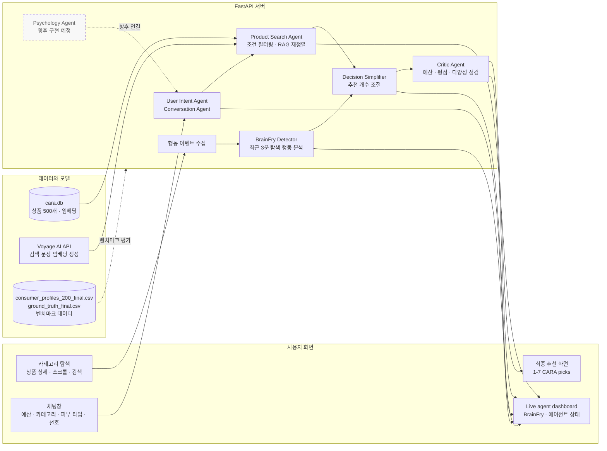

# CARA: BrainFry-Aware Cosmetic Recommendation Agent

CARA(Context-Aware Recommendation Agent)는 온라인 쇼핑 중 사용자가 느끼는 인지적 피로도인 **BrainFry**를 추정하고, 상황에 맞게 추천 상품 수를 줄여 주는 화장품 추천 프로토타입입니다.

일반적인 쇼핑몰이 많은 상품을 한 번에 보여 준다면, CARA는 사용자의 탐색 행동, 예산, 검색 의도, 피부 타입, 상품 유사도를 함께 고려합니다. 사용자가 선택에 어려움을 겪을수록 비교해야 할 상품 수를 줄여 더 간결한 추천을 제공합니다.

## 주요 기능

- 화장품 500개 카탈로그 제공
- 카테고리, 예산, 피부 타입 기반 상품 필터링
- Voyage AI 임베딩과 RAG 점수를 활용한 상품 재정렬
- 탐색 행동 기반 BrainFry 점수 계산
- BrainFry 점수에 따른 추천 개수 조절
- 추천 과정과 에이전트 상태를 확인할 수 있는 실시간 대시보드
- CARA, Random, Popular 추천 방식 비교 대시보드

## 데모 화면

서버 실행 후 브라우저에서 아래 주소에 접속합니다.

```text
http://127.0.0.1:8000
```

벤치마크 대시보드는 아래 주소에서 확인할 수 있습니다.

```text
http://127.0.0.1:8000/admin.html
```

메인 화면에서는 다음 내용을 확인할 수 있습니다.

```text
500 Products
10 Categories
1-7 CARA picks
```

## 아키텍처와 데이터 흐름

아래 도표는 사용자의 탐색 행동과 대화 조건이 최종 추천으로 이어지는 흐름을 보여 줍니다.



핵심 추천 흐름은 `탐색 행동 수집 → BrainFry 계산 → 대화 조건 확인 → 상품 검색 및 RAG 재정렬 → 추천 개수 조절 → 품질 점검` 순서입니다. `consumer_profiles_200_final.csv`와 `ground_truth_final.csv`는 운영 중 실시간 추천이 아니라 벤치마크 평가에 사용됩니다.

## 사용자 경험 흐름

1. 사용자가 여러 카테고리와 상품 상세 페이지를 탐색합니다.
2. CARA가 최근 탐색 행동을 바탕으로 BrainFry 점수를 계산합니다.
3. 사용자가 채팅창에 원하는 상품과 조건을 입력합니다.
4. CARA가 검색 의도, 예산, 피부 타입 등을 확인합니다.
5. 사용자가 추천 진행에 동의하면 상품 후보를 검색하고 RAG 점수를 계산합니다.
6. 사용자가 `Decision Simplifier` 버튼을 누르면 BrainFry 수준에 맞춰 최종 추천 개수를 줄입니다.
7. 최종 추천 상품이 화면에 표시됩니다.

예시 검색어:

```text
3000원 이하 디자인 예쁜 비타민C 마스크팩 추천해줘
```

이 문장은 예산, 성분, 카테고리, 디자인 선호를 함께 포함하므로 RAG 기반 추천 흐름을 시연하기 좋습니다.

## 에이전트 워크플로우

메인 화면 왼쪽의 `Live agent dashboard`는 추천 과정의 진행 상태를 보여 줍니다. 추천 흐름이 완료된 시점에는 다음과 같이 표시됩니다.

```text
User Intent Agent         running
BrainFry Detector         done
Psychology Agent          done
Conversation Agent        done
Product Search Agent      done
Decision Simplifier       done
Critic Agent              done
```

| 에이전트 | 역할 | 현재 상태 |
|---|---|---|
| `User Intent Agent` | 사용자의 검색 문장과 조건을 수집합니다. | 구현됨 |
| `BrainFry Detector` | 탐색 행동을 바탕으로 BrainFry 점수를 계산합니다. | 구현됨 |
| `Psychology Agent` | 심리적 선호를 독립적으로 분석하는 에이전트입니다. | **향후 구현 예정** |
| `Conversation Agent` | 사용자와 대화하며 추천 조건을 확인합니다. | 구현됨 |
| `Product Search Agent` | 조건에 맞는 후보 상품을 검색하고 RAG 점수를 계산합니다. | 구현됨 |
| `Decision Simplifier` | BrainFry 수준에 따라 최종 추천 개수를 줄입니다. | 구현됨 |
| `Critic Agent` | 추천 결과의 예산, 평점, 다양성을 점검합니다. | 구현됨 |

`Psychology Agent`는 현재 UI 워크플로우를 설명하기 위해 상태바에 포함되어 있습니다. 독립적인 심리 분석 로직은 아직 연결되어 있지 않으며, 추후 구현할 예정입니다.

## BrainFry 계산

BrainFry는 최근 탐색 행동을 바탕으로 `0`부터 `1` 사이의 값으로 계산됩니다. 값이 높을수록 사용자가 선택 과정에서 더 큰 피로를 겪고 있다고 해석합니다.

```text
N_norm       = min(page_visits / 10, 1)
sigma2_norm  = min(dwell_time_variance / 10000, 1)
CTR          = clip(ctr, 0, 1)
SR_inv       = 1 - clip(scroll_depth, 0, 1)
Q_norm       = min(query_reformulations / 5, 1)

BrainFry =
    0.25 * N_norm
  + 0.25 * sigma2_norm
  + 0.20 * (1 - CTR)
  + 0.15 * SR_inv
  + 0.15 * Q_norm
```

| 행동 신호 | 의미 |
|---|---|
| 페이지 이동 횟수 | 여러 카테고리와 상품을 오갈수록 증가합니다. |
| 체류시간 분산 | 상품별 고민 시간이 불규칙할수록 증가합니다. |
| CTR | 상품 노출 대비 클릭이 적을수록 증가합니다. |
| 스크롤 깊이 | 페이지를 충분히 탐색하지 않을수록 증가합니다. |
| 검색어 수정 횟수 | 검색어를 반복해서 바꿀수록 증가합니다. |

BrainFry 구간:

| 구간 | 조건 |
|---|---|
| `LOW` | `BrainFry <= 0.35` |
| `MID` | `0.35 < BrainFry <= 0.65` |
| `HIGH` | `BrainFry > 0.65` |

추천 개수는 다음 공식으로 결정됩니다.

```text
N_rec = max(1, round(7 * (1 - BrainFry)))
```

즉, 사용자가 편안하게 탐색하고 있을 때는 최대 7개를 보여 주고, 선택 피로가 높아지면 비교 대상 수를 줄입니다.

### 측정 주기

- 첫 측정: 페이지 진입 30초 후
- 서버 기록: 30초마다
- 화면 요약 갱신: 1초마다
- 추가 재계산: 카테고리 이동, 상품 클릭, 스크롤, 검색 입력, 채팅 입력 시
- 행동 데이터 보존: 최근 3분 슬라이딩 윈도우

3분마다 전체 기록을 한 번에 초기화하는 방식은 아닙니다. 3분이 지난 행동 기록이 순차적으로 제외됩니다.

## 상품 검색과 RAG 점수

상품 검색은 두 단계로 진행됩니다.

1. SQLite 데이터베이스에서 카테고리, 예산, 피부 타입 조건에 맞는 후보를 찾습니다.
2. 후보 상품의 의미 유사도, 스타일 일치 여부, 가격, 평점을 반영해 순서를 다시 정합니다.

현재 실시간 검색에 사용하는 RAG 점수는 다음과 같습니다.

```text
RAG_score =
    10 * semantic_similarity
  + 15 * style_match
  + 10 * price_score
  +  3 * star_rating
```

| 항목 | 의미 |
|---|---|
| `semantic_similarity` (`S`) | Voyage AI로 생성한 검색 문장 벡터와 상품 임베딩의 코사인 유사도입니다. |
| `style_match` | 상품의 스타일이 사용자의 선호 스타일과 일치하는지 확인합니다. |
| `price_score` | 상품 가격이 사용자의 예산에 얼마나 가까운지 반영합니다. |
| `star_rating` | 상품 평점을 반영합니다. |

### 의미 유사도 S 계산

`S`는 단순한 키워드 포함 여부가 아니라 외부 임베딩 모델을 활용한 의미 유사도입니다. 상품명, 브랜드, 키워드로 미리 생성한 상품 임베딩은 `cara.db`에 저장되어 있습니다. 사용자가 검색하면 CARA는 Voyage AI API를 호출해 검색 문장의 임베딩을 실시간으로 생성하고, 후보 상품 벡터와의 코사인 유사도를 계산합니다.

```text
query_vector   = VoyageAI.embed(user_query)
product_vector = cara.db.products.embedding

S = cosine_similarity(query_vector, product_vector)
```

현재 실시간 검색 벡터는 Voyage AI의 `voyage-large-2` 모델을 사용합니다. 외부 API 호출에 실패하거나 저장된 상품 임베딩이 없는 경우에는 검색어와 상품 정보의 키워드 일치율을 활용한 fallback 유사도를 적용합니다.

예를 들어 `비타민C 마스크팩`을 검색하면, 해당 상품은 다른 마스크팩보다 높은 의미 유사도를 받습니다. 예산과 스타일 조건을 함께 입력하면 같은 가격대 후보 중 더 적합한 상품이 상단에 배치됩니다.

## 데이터 구성

| 파일 | 설명 |
|---|---|
| `cara.db` | 화장품 500개와 상품 임베딩을 포함한 SQLite 데이터베이스 |
| `consumers.json` | 메인 데모에서 사용하는 사용자 프로필 |
| `consumer_profiles_200_final.csv` | 벤치마크용 소비자 프로필 200개 |
| `ground_truth_final.csv` | 벤치마크 정답 상품 목록 |
| `cara_sessions.db` | 세션 이벤트와 에이전트 실행 기록 |

상품 카테고리:

```text
스킨, 로션, 마스크팩, 립틴트, 하이라이터,
쿠션, 파운데이션, 블러셔, 샴푸, 바디워시
```

## 벤치마크

`admin.html`에서는 CARA를 두 가지 기준 추천과 비교합니다.

| 방식 | 설명 |
|---|---|
| `CARA` | BrainFry, 예산, 피부 타입, 선호 스타일, 검색 의도를 반영합니다. |
| `Random` | 조건에 맞는 상품 중 무작위로 추천합니다. |
| `Popular` | 리뷰 수가 많은 상품을 우선 추천합니다. |

현재 대시보드에 표시되는 주요 결과:

| 지표 | CARA | Random | Popular |
|---|---:|---:|---:|
| Hit@N | 97.5% | 60.5% | 39.0% |
| 예산 준수율 | 97.5% | 49.0% | 41.5% |
| 선호 일치율 | 0.69 | 0.64 | 0.64 |

BrainFry 분포:

| 구간 | 사용자 수 | 비율 |
|---|---:|---:|
| LOW | 31명 | 15.5% |
| MID | 109명 | 54.5% |
| HIGH | 60명 | 30.0% |

## 로컬 실행

### 1. 패키지 설치

```powershell
python -m pip install -r requirements.txt
```

### 2. 환경변수 설정

`.env.example`을 참고해 `.env` 파일을 구성합니다.

```text
ANTHROPIC_API_KEY=
VOYAGE_API_KEY=
OPENAI_API_KEY=
```

| 환경변수 | 용도 |
|---|---|
| `ANTHROPIC_API_KEY` | 대화 응답과 Persona 평가 |
| `VOYAGE_API_KEY` | 실시간 의미 유사도 검색 |
| `OPENAI_API_KEY` | 일부 보조 기능 |
| `DB_PATH` | 상품 DB 경로를 별도로 지정할 때 사용 |
| `DATABASE_URL` | 세션 DB 연결 주소를 별도로 지정할 때 사용 |

### 3. 서버 실행

```powershell
python -m uvicorn main:app --host 127.0.0.1 --port 8000
```

## Render 배포

프로젝트 루트의 `render.yaml`에는 다음 시작 명령이 설정되어 있습니다.

```text
gunicorn main:app -w 1 -k uvicorn.workers.UvicornWorker --bind 0.0.0.0:$PORT
```

Render 환경변수에는 최소한 다음 값을 등록합니다.

```text
ANTHROPIC_API_KEY
VOYAGE_API_KEY
```

## 주요 API

| Method | Endpoint | 설명 |
|---|---|---|
| `GET` | `/health` | 서버 상태 확인 |
| `GET` | `/products/search` | 상품 검색과 RAG 재정렬 |
| `GET` | `/products/trending` | 카테고리별 인기 상품 |
| `POST` | `/api/passive-tracking` | BrainFry 행동 로그 기록 |
| `POST` | `/api/chat` | 대화 기반 추천 조건 확인 |
| `POST` | `/api/recommend` | 최종 추천 파이프라인 실행 |
| `GET` | `/admin/benchmark/dashboard` | 벤치마크 데이터 조회 |

## 주요 파일

| 파일 | 설명 |
|---|---|
| `main.py` | FastAPI 서버와 API 엔드포인트 |
| `CARA.html` | 메인 쇼핑 데모 화면 |
| `admin.html` | 벤치마크 대시보드 |
| `planner_agent.py` | 추천 계획과 BrainFry 계산 |
| `executor_agent.py` | 상품 검색 실행 |
| `critic_agent.py` | 최종 추천 검토 |
| `conversation_agent.py` | 사용자 대화 처리 |
| `vector_search.py` | 임베딩 검색과 RAG 점수 계산 |
| `database.py` | 세션 로그 저장 |

## 현재 프로토타입의 범위

- `Psychology Agent`는 향후 구현 예정입니다.
- 현재 BrainFry 최종 점수는 행동 로그를 기반으로 계산합니다.
- 실시간 의미 검색에는 Voyage AI API 키가 필요합니다.
- SQLite 파일은 Render 재배포 또는 재시작 시 초기 상태로 돌아갈 수 있습니다. 장기 보존이 필요하면 외부 DB 또는 Persistent Disk 구성이 필요합니다.
- 이 프로젝트는 연구 및 시연 목적의 프로토타입입니다.
