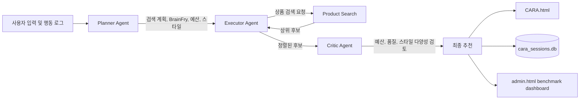

# CARA: BrainFry-Aware Cosmetic Recommendation Agent

CARA는 사용자의 의사결정 피로도(BrainFry), 예산, 피부 타입, 선호 스타일, 심리 유형을 반영하여 화장품을 추천하는 멀티 에이전트 시스템입니다.
이 문서는 논문 작성과 실험 재현을 위한 기술 문서입니다. 현재 저장소의 실제 실행 경로를 기준으로 작성했으며, 과거 프로토타입 설명과 현재 구현을 구분합니다.

---

## 1. 연구 목적

온라인 쇼핑 환경에서는 상품 수가 많을수록 항상 더 나은 선택이 이루어지는 것은 아닙니다. CARA는 사용자의 현재 피로도를 추정하고, 피로도가 높을수록 추천 후보 수를 줄여 선택 부담을 낮춥니다.

현재 구현의 핵심 질문은 다음과 같습니다.

1. BrainFry 점수에 따라 추천 개수를 조절하면 선택 부담을 줄일 수 있는가?
2. 예산, 피부 타입, 선호 스타일을 반영한 CARA가 비개인화 baseline보다 정답 상품을 더 자주 포함하는가?
3. 추천 결과가 각 소비자의 선호 스타일과 예산을 얼마나 잘 준수하는가?
4. Critic Agent가 초기 후보를 몇 번 수정해야 최종 추천 품질 기준을 만족하는가?

---

## 2. 현재 구현 요약

| 항목 | 현재 구현 |
|---|---|
| 상품 데이터 | `cara.db`, 총 500개 |
| 상품 카테고리 | 스킨, 로션, 마스크팩, 립틴트, 하이라이터, 쿠션, 파운데이션, 블러셔, 샴푸, 바디워시 |
| 실시간 추천 엔드포인트 | `POST /api/recommend` |
| 실시간 검색 | Voyage 임베딩 기반 cosine similarity + 구조화 특성 reranking |
| benchmark 검색 | 외부 API 지연을 제거하기 위한 로컬 lexical similarity + 동일한 구조화 특성 reranking |
| BrainFry 최종 점수 | 현재는 행동 기반 점수만 사용 |
| 추천 개수 | `N = max(1, round(7 * (1 - B_final)))` |
| 에이전트 | Planner, Executor, Critic, Conversation |
| benchmark 소비자 | `consumer_profiles_200_final.csv`, 200명 |
| baseline | Random, Popular |
| 대시보드 | `http://127.0.0.1:8000/admin.html` |

---

## 3. 시스템 구조



실시간 추천과 benchmark는 동일한 추천 API를 사용합니다. 다만 benchmark에서는 200명 전체를 안정적으로 반복 실행하기 위해 외부 임베딩 호출 대신 로컬 lexical 검색 모드를 사용합니다.

---

## 4. 데이터 구성

### 4.1 상품 데이터: `cara.db`

`products` 테이블은 총 500개 상품을 포함합니다.

| 주요 컬럼 | 의미 |
|---|---|
| `product_id` | 상품 식별자 |
| `subcategory` | 상품 세부 카테고리 |
| `product_name`, `brand`, `brand_tier` | 상품명, 브랜드, 브랜드 등급 |
| `price`, `price_percentile` | 가격, 카테고리 내 가격 분위 |
| `star_rating`, `review_count` | 평점, 리뷰 수 |
| `skin_type` | 적합 피부 타입 |
| `preference_style` | `hedonic` 또는 `utilitarian` |
| `sentiment_score`, `keywords` | 감성 점수, 검색 키워드 |
| `embedding` | 저장된 상품 임베딩 |

카테고리별 상품 수는 각각 50개입니다. 현재 모든 500개 상품에 임베딩이 저장되어 있습니다.

립틴트, 블러셔, 하이라이터는 스타일 편향을 줄이기 위해 각 카테고리별로 다음과 같이 재분류되어 있습니다.

| 카테고리 | `utilitarian` | `hedonic` |
|---|---:|---:|
| 립틴트 | 15 | 35 |
| 블러셔 | 15 | 35 |
| 하이라이터 | 15 | 35 |

### 4.2 실시간 사용자 데이터: `consumers.json`

웹 UI에서 추천을 실행할 때 사용하는 소비자 프로필입니다. 실시간 사용자 경험 확인용 데이터이며, 논문 benchmark의 200명 데이터와는 구분됩니다.

### 4.3 benchmark 입력 데이터

아래 두 파일은 기본적으로 사용자 다운로드 폴더에서 읽습니다.

| 파일 | 행 수 | 용도 |
|---|---:|---|
| `C:\Users\gram\Downloads\consumer_profiles_200_final.csv` | 200 | benchmark 소비자 프로필 |
| `C:\Users\gram\Downloads\ground_truth_final.csv` | 4,364 | 소비자별 정답 상품 목록 |

`consumer_profiles_200_final.csv` 주요 컬럼:

```text
consumer_id, psychographic_type, preference_style, budget_tier,
budget_amount, skin_type, subcategory, brainfry_score
```

`subcategory`에 쉼표로 여러 카테고리가 있으면 baseline 및 CARA benchmark 모두 첫 번째 카테고리만 사용합니다.

---

## 5. 추천 파이프라인

### 5.1 Planner Agent

`planner_agent.py`는 사용자 입력과 행동 로그를 바탕으로 검색 계획을 생성합니다.

주요 작업:

1. 검색 질의 정리
2. 대상 카테고리 추론
3. 심리 유형(`psychographic_type`) 결정
4. 행동 기반 BrainFry 점수 계산
5. 예산 상한 추론
6. 선호 스타일 결정

예산 추론 우선순위:

1. 사용자가 직접 입력한 예산
2. 카테고리 가격 분포와 과거 구매 금액을 반영한 상한
3. 과거 최대 구매 금액
4. 플랫폼 기본 예산

### 5.2 Executor Agent

`executor_agent.py`는 Planner가 만든 검색 계획을 받아 `/products/search`를 호출합니다.

전달되는 주요 조건:

- 검색 질의
- 카테고리
- 예산 상한
- 피부 타입
- 선호 스타일
- vector 검색 사용 여부

초기 후보가 3개 미만이면 같은 카테고리의 trending 상품을 병합합니다. 이후 검색 단계에서 계산된 `RAG_score`를 유지한 채 내림차순으로 정렬하고, Critic Agent에 후보를 전달합니다.

### 5.3 Critic Agent

`critic_agent.py`는 초기 후보를 검토하여 최종 추천을 만듭니다.

현재 상수:

```python
MIN_RATING = 3.8
MAX_ITERATIONS = 2
BUDGET_RELAXATION_FACTOR = 1.2
MIN_BEFORE_RELAXATION = 2
```

각 반복에서 수행하는 검토:

1. 예산 초과 상품 제거
2. 평점 `3.8` 미만 상품 제거
3. 추천 결과가 하나의 스타일에만 치우치면 반대 스타일 후보 보완
4. 유효 후보가 2개 미만이면 예산 상한을 20% 완화하고 후보 복원
5. BrainFry 기반 추천 개수만큼 상위 상품 선택

최종 후보가 하나도 남지 않으면 fallback 후보를 다시 채웁니다.

`correction_iterations`는 Critic Agent가 실제로 수행한 반복 횟수입니다. `/api/recommend` 응답의 `critic_iterations`로 노출되고, `cara_results.csv`에 저장됩니다.

### 5.4 Conversation Agent

`conversation_agent.py`는 추천 결과를 자연어로 설명합니다. Anthropic API 키가 있으면 Claude 기반 응답을 생성할 수 있습니다.

현재 추천 개수 결정에는 텍스트 분석 BrainFry 점수를 사용하지 않습니다. 텍스트 기반 점수 필드는 향후 실험을 위해 남아 있지만 현재 값은 `0`입니다.

---

## 6. BrainFry 계산식

### 6.1 행동 기반 점수

행동 기반 BrainFry 점수는 `planner_agent.py`에서 다음과 같이 계산합니다.

```text
N_norm       = min(page_visits / 10, 1)
sigma2_norm  = min(dwell_time_variance / 10000, 1)
CTR          = clip(ctr, 0, 1)
SR_inv       = 1 - clip(scroll_depth, 0, 1)
Q_norm       = min(query_reformulations / 5, 1)

B_behavioral =
    0.25 * N_norm
  + 0.25 * sigma2_norm
  + 0.20 * (1 - CTR)
  + 0.15 * SR_inv
  + 0.15 * Q_norm
```

최종 값은 `[0, 1]` 범위로 제한하고 소수점 넷째 자리까지 반올림합니다.

| 요소 | 가중치 | 해석 |
|---|---:|---|
| 페이지 방문 수 | 0.25 | 탐색량이 많을수록 피로 증가 |
| 체류 시간 분산 | 0.25 | 상품 비교 패턴이 불안정할수록 피로 증가 |
| 클릭률의 역수 | 0.20 | 탐색 대비 클릭이 적을수록 피로 증가 |
| 스크롤 깊이의 역수 | 0.15 | 깊이 탐색하지 못할수록 피로 증가 |
| 검색어 재작성 수 | 0.15 | 검색어를 반복 수정할수록 피로 증가 |

### 6.2 최종 점수

현재 구현:

```text
B_final = clip(B_behavioral, 0, 1)
```

`compute_final_score(b_behavioral, b_text)` 함수는 인터페이스상 `b_text`를 받지만, 현재 버전에서는 의도적으로 행동 기반 점수만 반환합니다. 따라서 논문에서 현재 실험 결과를 설명할 때 텍스트 기반 BrainFry가 반영되었다고 기술하면 안 됩니다.

### 6.3 BrainFry 구간

| 구간 | 조건 |
|---|---|
| LOW | `B_final <= 0.35` |
| MID | `0.35 < B_final <= 0.65` |
| HIGH | `B_final > 0.65` |

### 6.4 추천 개수

```text
N_rec = max(1, round(7 * (1 - B_final)))
```

BrainFry가 높을수록 추천 수가 줄어듭니다. Critic Agent는 심리 유형이 `impulsive`이고 BrainFry가 `HIGH`인 경우 추천 수를 1개로 제한합니다.

---

## 7. Retrieval 및 RAG 점수

### 7.1 1차 SQL 후보 필터

`main.py`의 `/products/search`는 먼저 `cara.db`에서 최대 50개 후보를 읽습니다.

```sql
SELECT ...
FROM products
WHERE subcategory = ?
  AND (? IS NULL OR price <= ?)
  AND (? IS NULL OR skin_type IN (?, 'all'))
ORDER BY star_rating DESC
LIMIT 50
```

즉, 카테고리, 예산, 피부 타입은 reranking 이전에 적용됩니다.

### 7.2 현재 활성화된 RAG reranking 식

실시간 추천과 benchmark의 실제 실행 경로에서 사용하는 점수는 `vector_search.py`에 정의되어 있습니다.

```text
style_match = 1 if product.preference_style == preferred_style else 0

price_score =
    exp(-abs(product.price - budget) / max(category_avg_price, 1))

RAG_db =
    10 * similarity
  + 15 * style_match
  + 10 * price_score
  +  3 * star_rating
```

| 항목 | 의미 |
|---|---|
| `similarity` | 질의와 상품의 의미 또는 lexical 유사도 |
| `style_match` | 사용자 선호 스타일 일치 여부 |
| `price_score` | 예산과 상품 가격의 거리 기반 지수 감쇠 점수 |
| `star_rating` | 상품 평점 |

### 7.3 실시간 vector 검색

기본값은 `use_vector_search=true`입니다.

- 질의 임베딩: Voyage API, `voyage-large-2`
- 상품 임베딩: `cara.db`에 저장된 1,536차원 벡터
- 유사도: cosine similarity

### 7.4 benchmark lexical 검색

`run_benchmark.py`는 추천 API 호출 시 다음 값을 전달합니다.

```json
{
  "use_vector_search": false
}
```

이 모드에서는 외부 API 호출 없이 로컬 lexical similarity를 사용합니다. 검색어 토큰이 상품명, 브랜드, 카테고리, 키워드, 피부 타입 문자열에 얼마나 포함되는지 비율로 계산합니다.

benchmark에서 lexical 모드를 사용하는 이유:

1. 외부 API 지연 및 일시적 오류 제거
2. 200명 반복 실행의 안정성 향상
3. 동일 입력에 대한 재현성 향상

따라서 논문에서 실시간 사용자 흐름과 benchmark 실험 설정을 구분해 기술해야 합니다.

### 7.5 보조 RAG 함수

`executor_agent.py`에는 키워드, 카테고리, 스타일, 가격, 평점, 감성 점수, 리뷰 수를 함께 사용하는 `compute_rag_score()` 보조 함수도 존재합니다. 그러나 현재 `execute_plan()`의 주 실행 경로에서는 이 함수를 다시 호출하지 않고 `/products/search`가 반환한 `RAG_score`를 유지합니다.

현재 실험을 설명할 때는 위의 `RAG_db` 식을 사용해야 합니다.

---

## 8. benchmark 구성

### 8.1 평가 시스템

| 시스템 | 개인화 여부 | 상품 선택 방식 |
|---|---|---|
| CARA | 사용 | BrainFry, 예산, 피부 타입, 선호 스타일, 검색 질의 반영 |
| Baseline-Random | 미사용 | 해당 카테고리 전체 상품 중 무작위 `N`개 |
| Baseline-Popular | 미사용 | 해당 카테고리에서 `review_count` 내림차순 상위 `N`개 |

세 시스템 모두 소비자의 `brainfry_score`로 추천 개수 `N`을 계산합니다.

```text
N = max(1, round(7 * (1 - brainfry_score)))
```

Baseline-Random은 고정 seed `20260530`을 사용합니다. Baseline-Popular는 리뷰 수가 같으면 `product_id`로 순서를 고정합니다.

반올림 경계값에 대한 구현 차이도 주의해야 합니다. `generate_baselines.py`는 `ROUND_HALF_UP`을 사용하고, CARA 본체의 `critic_agent.py`는 Python 기본 `round()`를 사용합니다. 따라서 `7 * (1 - brainfry_score)`가 정확히 `.5`인 경우 추천 수가 달라질 수 있습니다. 공식 실험을 다시 수행할 때 경계값이 포함되어 있다면 두 구현을 하나의 반올림 정책으로 통일해야 합니다.

### 8.2 실행 순서

의존성 설치:

```powershell
python -m pip install -r requirements.txt
```

서버 실행:

```powershell
python -m uvicorn main:app --host 127.0.0.1 --port 8000
```

baseline 생성은 데이터셋이 변경될 때 한 번만 실행합니다.

```powershell
python generate_baselines.py
```

CARA 로직을 수정할 때마다 benchmark를 다시 실행합니다.

```powershell
python run_benchmark.py
```

Claude 기반 Persona 평가가 필요하면 별도로 실행합니다.

```powershell
python score_personas.py
```

Persona 평가 전에 일부 샘플만 확인할 수도 있습니다.

```powershell
python score_personas.py --limit 1
python score_personas.py --dry-run
```

### 8.3 산출 파일

| 파일 | 생성 스크립트 | 용도 |
|---|---|---|
| `baseline_random_results.csv` | `generate_baselines.py` | Random baseline 추천 결과 |
| `baseline_popular_results.csv` | `generate_baselines.py` | Popular baseline 추천 결과 |
| `cara_results.csv` | `run_benchmark.py` | CARA 추천 결과 및 Critic 반복 횟수 |
| `benchmark_results.csv` | `run_benchmark.py` | 소비자별 benchmark 지표 |
| `persona_scores.csv` | `score_personas.py` | Claude 기반 persona 만족도와 결정 용이성 |

`cara_results.csv` 주요 컬럼:

```text
consumer_id, psychographic_type, brainfry_score, n_recommended,
product_id, product_name, brand, price, star_rating, rank_position,
critic_iterations
```

`benchmark_results.csv` 주요 컬럼:

```text
consumer_id, psychographic_type, brainfry_score, n_recommended,
cara_hit, random_hit, popular_hit,
cara_budget_compliance, random_budget_compliance, popular_budget_compliance,
cara_alignment, random_alignment, popular_alignment
```

---

## 9. 평가 지표 정의

### 9.1 Hit@N

소비자 `u`의 정답 상품 집합을 `G_u`, 추천 상품 집합을 `R_u`라고 할 때:

```text
Hit@N(u) = 1 if intersection(G_u, R_u) is not empty else 0
Hit@N    = mean(Hit@N(u))
```

Ground Truth가 없는 소비자는 계산에서 제외합니다.

### 9.2 Preference Alignment Score

```text
Alignment(u) =
    선호 스타일과 일치하는 추천 상품 수
    / 전체 추천 상품 수
```

전체 점수는 소비자별 alignment의 평균입니다.

### 9.3 예산 준수율: 두 가지 운영 정의

현재 저장소에는 목적이 다른 두 가지 예산 준수율이 있습니다. 논문에서는 하나를 선택하여 일관되게 보고해야 합니다.

#### A. 대시보드 기준: 소비자 단위 strict compliance

한 소비자에게 추천된 상품이 모두 예산 이하일 때만 `1`입니다.

```text
StrictBudget(u) = 1 if every recommended price <= budget else 0
StrictBudget    = mean(StrictBudget(u))
```

`admin.html`의 핵심 지표 테이블은 이 값을 표시합니다.

#### B. `run_benchmark.py` 기준: 상품 단위 compliance

각 소비자의 추천 상품 중 예산 이하 상품의 비율입니다.

```text
ItemBudget(u) =
    예산 이하 추천 상품 수
    / 전체 추천 상품 수
```

`benchmark_results.csv`의 `*_budget_compliance` 컬럼과 콘솔 출력은 이 값을 사용합니다.

### 9.4 Critic 평균 반복 횟수

```text
CriticAvg =
    mean(소비자별 critic_iterations)
```

`cara_results.csv`는 상품별로 한 행을 가지므로, 대시보드는 소비자별 첫 번째 행의 `critic_iterations`를 사용해 중복을 제거한 후 평균을 계산합니다.

값이 낮을수록 Critic Agent가 초기 추천을 적게 수정했다는 의미입니다. 다만 이것만으로 최종 추천 품질이 높다고 단정할 수는 없으므로 Hit@N, 예산 준수율, alignment와 함께 해석해야 합니다.

### 9.5 Persona Satisfaction 및 Decision Ease

`score_personas.py`는 `cara_results.csv`의 추천 결과를 소비자 심리 유형별 시스템 프롬프트와 함께 Claude API에 전달합니다.

현재 모델:

```text
claude-sonnet-4-6
```

각 소비자에 대해 다음 두 점수를 `1~5` 범위로 수집합니다.

| 점수 | 의미 |
|---|---|
| `persona_satisfaction` | 해당 심리 유형 관점에서 추천 결과에 대한 만족도 |
| `decision_ease` | 추천 결과를 보고 결정을 내리기 쉬운 정도 |

API 오류 시 한 번 재시도합니다. 응답에서 두 숫자를 파싱하지 못하면 기본값 `3, 3`을 저장합니다. 이 평가는 LLM-as-a-Judge 보조 지표이므로 정답 기반 Hit@N과 구분하여 해석해야 합니다.

---

## 10. 현재 benchmark 결과 스냅샷

아래 결과는 현재 저장소의 CSV 산출물 기준입니다. 코드, 데이터, 모델 응답을 다시 생성하면 값이 달라질 수 있습니다.

### 10.1 핵심 지표

| 지표 | CARA | Random | Popular |
|---|---:|---:|---:|
| Hit@N | 97.5% | 60.5% | 39.0% |
| 예산 준수율: dashboard strict 기준 | 97.5% | 49.0% | 41.5% |
| 예산 준수율: script 상품 단위 기준 | 97.8% | 68.6% | 55.2% |
| Preference Alignment | 0.69 | 0.64 | 0.64 |

### 10.2 Critic 및 BrainFry 분포

| 항목 | 값 |
|---|---:|
| Critic 평균 반복 횟수 | 1.51회 |
| LOW (`B <= 0.35`) | 31명, 15.5% |
| MID (`0.35 < B <= 0.65`) | 109명, 54.5% |
| HIGH (`B > 0.65`) | 60명, 30.0% |

### 10.3 Persona Satisfaction

| 유형 | Persona Satisfaction | Decision Ease |
|---|---:|---:|
| 전체 평균 | 4.1 / 5 | 3.8 / 5 |
| Maximizer | 4.1 / 5 | 3.0 / 5 |
| ValueSeeker | 3.7 / 5 | 3.5 / 5 |
| LossAverse | 4.8 / 5 | 4.8 / 5 |
| Impulsive | 4.9 / 5 | 4.9 / 5 |
| Hedonic | 3.1 / 5 | 3.1 / 5 |
| Utilitarian | 3.9 / 5 | 3.7 / 5 |

---

## 11. benchmark 대시보드

서버 실행 후 다음 URL에서 확인할 수 있습니다.

```text
http://127.0.0.1:8000/admin.html
```

대시보드 구성:

1. CARA, Random, Popular 핵심 지표 비교
2. 유형별 Persona Satisfaction
3. Critic 평균 반복 횟수
4. BrainFry 분포
5. CSV 다운로드

다운로드 API:

| URL | 파일 |
|---|---|
| `/admin/benchmark/download/metrics` | `benchmark_results.csv` |
| `/admin/benchmark/download/persona-satisfaction` | `persona_scores.csv` |
| `/admin/benchmark/download/consumer-profiles` | `consumer_profiles_200_final.csv` |

대시보드의 Hit@N과 Preference Alignment는 현재 확정한 benchmark 스냅샷 값을 표시합니다. strict 예산 준수율, Critic 평균 반복 횟수, Persona Satisfaction, BrainFry 분포는 CSV에서 계산합니다.

---

## 12. 주요 API

| Method | Endpoint | 용도 |
|---|---|---|
| `GET` | `/health` | 서버 상태 확인 |
| `GET` | `/CARA.html` | 사용자용 웹 UI |
| `GET` | `/admin.html` | benchmark 대시보드 |
| `GET` | `/products/search` | 상품 필터 및 reranking |
| `GET` | `/products/trending` | 카테고리별 fallback 상품 |
| `GET` | `/products/price-distributions` | 카테고리 가격 분포 |
| `POST` | `/api/plan` | Planner 결과 확인 |
| `POST` | `/api/passive-tracking` | 행동 로그 수집 |
| `POST` | `/api/chat` | 대화형 추천 |
| `POST` | `/api/recommend` | 전체 추천 파이프라인 실행 |
| `GET` | `/admin/benchmark/dashboard` | CSV 기반 dashboard 데이터 |

`POST /api/recommend` benchmark 요청 예시:

```json
{
  "consumer_id": "C0001",
  "query": "립틴트",
  "budget_ceiling": 20000,
  "skin_type": "all",
  "preferred_style": "hedonic",
  "psychographic_type": "hedonic",
  "brainfry_score": 0.42,
  "use_vector_search": false
}
```

---

## 13. 환경 변수

`.env.example`을 시작점으로 `.env`를 구성합니다. 현재 예시 파일에는 Anthropic, OpenAI 키가 있으며, 실시간 vector 검색을 사용하려면 Voyage 키도 추가합니다.

| 환경 변수 | 용도 |
|---|---|
| `ANTHROPIC_API_KEY` | Conversation Agent 및 Persona 평가 |
| `VOYAGE_API_KEY` | 실시간 질의 임베딩 |
| `OPENAI_API_KEY` | 일부 보조 기능 |

benchmark lexical 모드는 Voyage API 없이 실행할 수 있습니다. `score_personas.py` 실행에는 Anthropic API 키가 필요하며 API 사용료가 발생합니다.

---

## 14. 파일 안내

| 파일 | 역할 |
|---|---|
| `main.py` | FastAPI 서버, 추천 API, dashboard API |
| `planner_agent.py` | 검색 계획, BrainFry, 예산 추론 |
| `executor_agent.py` | 상품 검색 실행, 후보 병합 및 정렬 |
| `critic_agent.py` | 예산, 품질, 스타일 다양성 검토 |
| `conversation_agent.py` | 사용자용 자연어 응답 |
| `vector_search.py` | 임베딩 및 lexical reranking |
| `database.py` | 세션 이벤트, trace, 채팅 로그 저장 |
| `cara.db` | 500개 상품 데이터 |
| `cara_sessions.db` | 실행 로그 및 에이전트 trace |
| `CARA.html` | 사용자용 웹 UI |
| `admin.html` | benchmark 대시보드 |
| `generate_baselines.py` | Random, Popular baseline 생성 |
| `run_benchmark.py` | CARA 200회 실행 및 핵심 지표 계산 |
| `score_personas.py` | Claude 기반 Persona 평가 |

---

## 15. 논문 작성 시 주의사항

1. 현재 `B_final`은 행동 기반 BrainFry만 사용합니다. 텍스트 기반 BrainFry 결합 실험으로 설명하면 안 됩니다.
2. 실시간 UI는 vector 검색, 200명 benchmark는 lexical 검색을 사용합니다. 두 환경을 동일한 retrieval 설정으로 기술하면 안 됩니다.
3. 현재 활성 RAG 식은 `vector_search.py`의 `RAG_db`입니다. `executor_agent.py`의 보조 점수 함수는 현재 주 실행 경로에서 사용하지 않습니다.
4. 예산 준수율은 dashboard strict 기준과 script 상품 단위 기준이 다릅니다. 표와 본문에서 어떤 정의를 사용했는지 명시해야 합니다.
5. Persona Satisfaction과 Decision Ease는 Claude 기반 보조 평가입니다. 정답 기반 성능 지표와 분리하여 보고해야 합니다.
6. Critic 평균 반복 횟수는 초기 추천 수정량에 대한 운영 지표입니다. 독립적인 품질 지표로 해석하지 않습니다.
7. `persona_scores.csv`는 외부 모델 응답에 따라 재실행 시 달라질 수 있습니다. 논문 결과를 고정하려면 사용 모델, 실행 날짜, CSV 스냅샷을 함께 보관해야 합니다.
8. 추천 수 산정식은 같지만 baseline과 CARA의 `.5` 반올림 정책이 현재 다릅니다. 경계값이 있는 공식 실험에서는 정책을 통일해야 합니다.

---

## 16. 재현 체크리스트

- [ ] `cara.db` 상품 수가 500개인지 확인
- [ ] `consumer_profiles_200_final.csv`가 200명인지 확인
- [ ] `ground_truth_final.csv` 경로 확인
- [ ] 상품 또는 소비자 데이터 변경 시 `generate_baselines.py` 재실행
- [ ] CARA 코드 변경 시 `run_benchmark.py` 재실행
- [ ] Persona 평가가 필요할 때 `score_personas.py` 실행
- [ ] dashboard strict 예산 준수율과 script 상품 단위 준수율 구분
- [ ] 논문에 retrieval 모드와 모델 버전 기록
